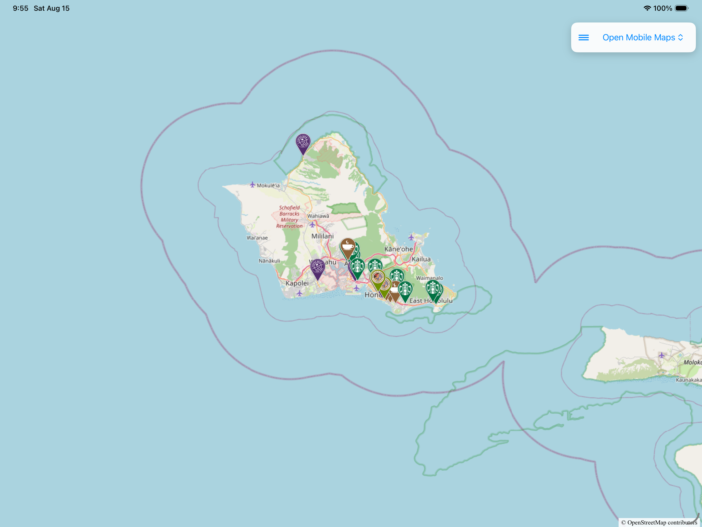
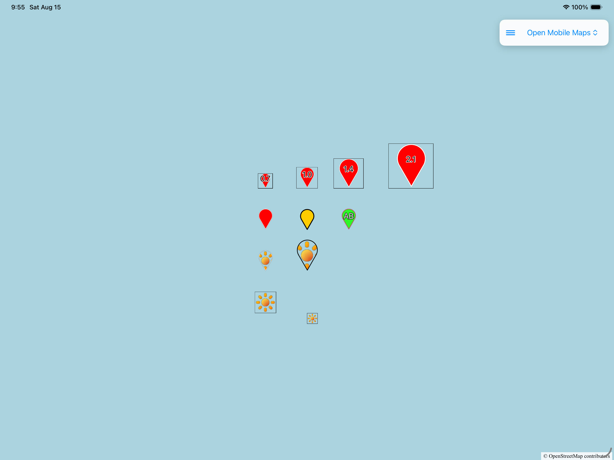
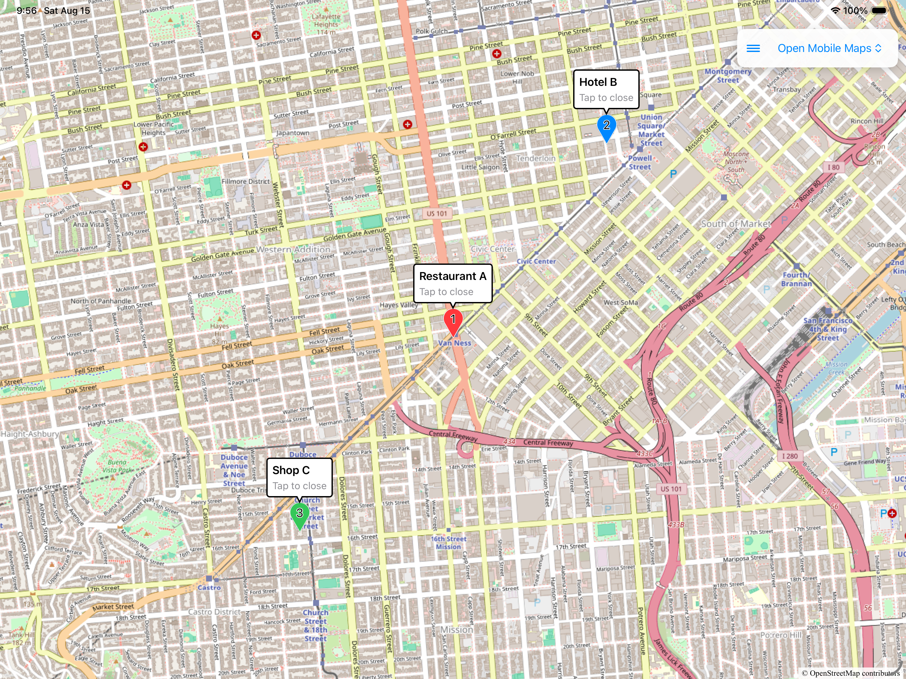
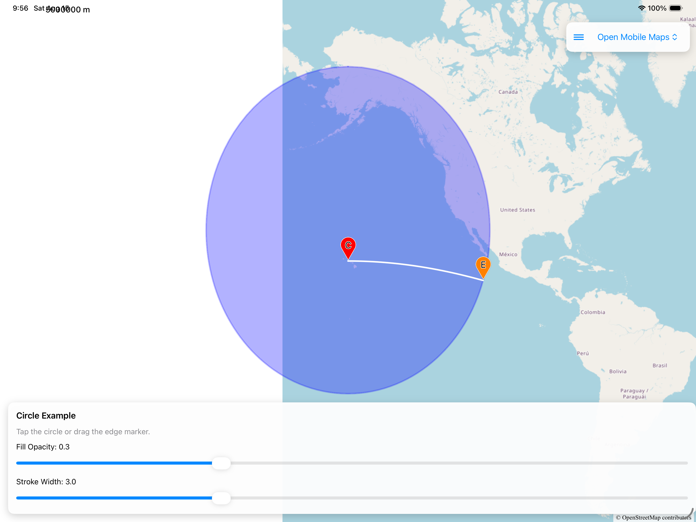
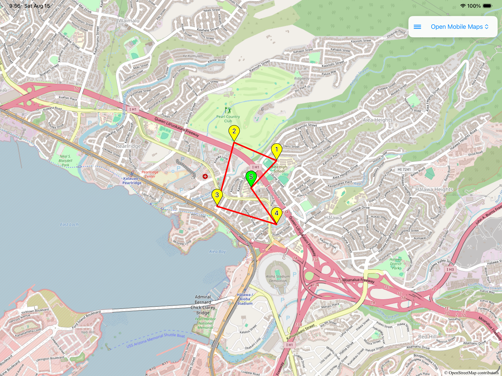
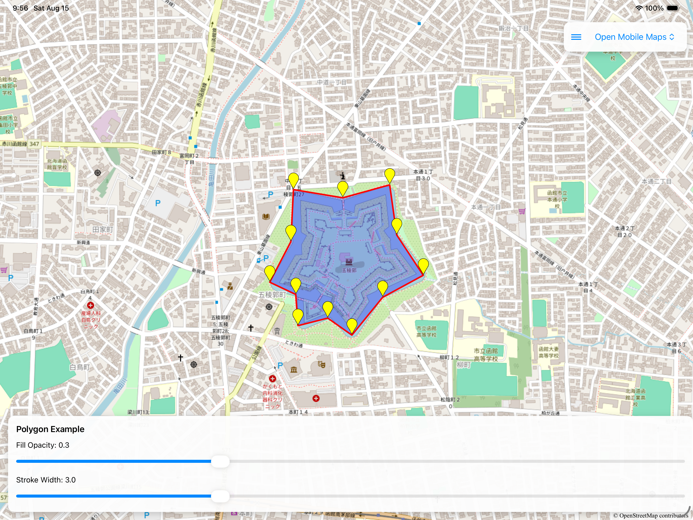
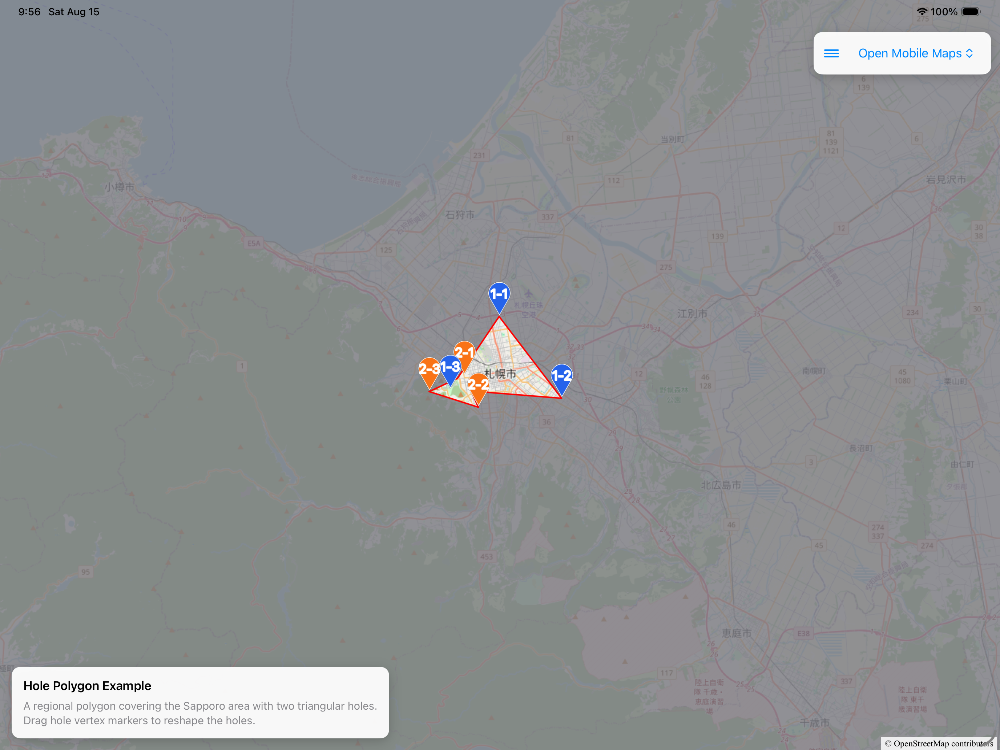
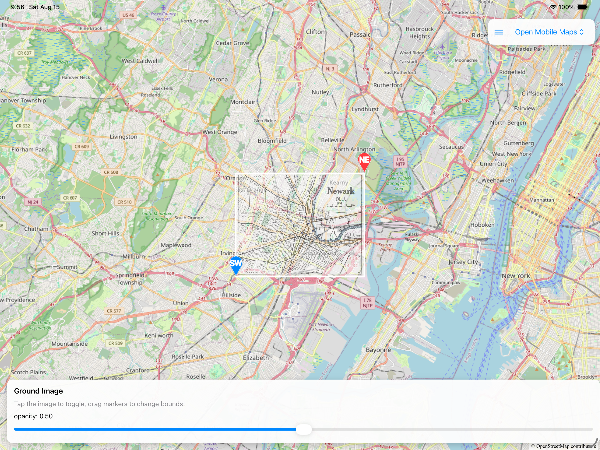

# Open Mobile Maps SDK for MapConductor iOS

## Description

MapConductor provides a unified API for iOS SwiftUI.
You can use Open Mobile Maps with SwiftUI, but you can also switch to other Maps SDKs (such as MapKit, MapLibre, and Mapbox), anytime.
Even using the wrapper API, you can still access the native Open Mobile Maps view if you want.

## Setup

https://mapconductor.com/setup/

### API key

**No API key.** Open Mobile Maps renders from the style you configure.

### Clone maps-core locally

Open Mobile Maps requires a local `maps-core` checkout with its submodules:

```bash
cd ios-sdk
git clone --recurse-submodules --branch 4.0.0 --depth 1 \
  https://github.com/openmobilemaps/maps-core
```

The `maps-core` 4.0.0 package switches its Djinni dependency to the relative
`external/djinni` path when the submodule is present. SwiftPM cannot resolve that
local dependency when `maps-core` itself is fetched as a remote package, so this
package uses the checkout at `../maps-core` when it is available.

Keep `--recurse-submodules` in the clone command. The submodule pins Djinni 1.4.0,
while the remote fallback resolves an older 1.0.x release.

### Install the Metal toolchain

`maps-core` contains Metal shaders. With Xcode 26 or later, install the separate
Metal toolchain once on each development or CI machine:

```bash
xcodebuild -downloadComponent MetalToolchain
```

You can also install it from Xcode → Settings → Components → Metal Toolchain.

### Build and test

```bash
cd ios-sdk/ios-for-openmobilemaps
xcodebuild test -scheme mapconductor-for-openmobilemaps \
  -destination 'platform=iOS Simulator,name=iPhone 17 Pro'
```

## Usage

```swift
import SwiftUI
import MapConductorCore
import MapConductorForOpenMobileMaps

struct MapView: View {
    @StateObject private var mapViewState = OpenMobileMapsViewState(
        cameraPosition: MapCameraPosition(
            position: GeoPoint(latitude: 35.6762, longitude: 139.6503),
            zoom: 2
        )
    )
    @State private var selectedMarker: MarkerState? = nil

    let center = GeoPoint(latitude: 35.6762, longitude: 139.6503)

    var body: some View {
        OpenMobileMapsMapView(state: mapViewState) {
            Marker(
                position: center,
                icon: DefaultMarkerIcon(label: "Tokyo"),
                onClick: { state in selectedMarker = state }
            )
            if let selected = selectedMarker {
                InfoBubble(marker: selected) {
                    Text("Hello, world!")
                }
            }
        }
    }
}
```

## Components

### OpenMobileMapsMapView [[docs]](https://mapconductor.com/mapview/)

```swift
struct MapExample: View {
    @StateObject private var mapViewState = OpenMobileMapsViewState(
        cameraPosition: MapCameraPosition(
            position: GeoPoint(latitude: 37.422198, longitude: -122.085377),
            zoom: 17,
            tilt: 60,
            bearing: 30
        )
    )

    var body: some View {
        OpenMobileMapsMapView(state: mapViewState)
    }
}
```


------------------------------------------------------------------------

### Marker [[docs]](https://mapconductor.com/markers/)

```swift
struct MarkerExample: View {
    @State private var markerState = MarkerState(
        position: GeoPoint(latitude: 35.6762, longitude: 139.6503),
        icon: DefaultMarkerIcon(label: "Tokyo"),
        onClick: { state in state.animate(.bounce) }
    )

    var body: some View {
        OpenMobileMapsMapView(state: mapViewState) {
            Marker(state: markerState)
        }
    }
}
```


------------------------------------------------------------------------

### InfoBubble [[docs]](https://mapconductor.com/info-bubble/)

```swift
struct InfoBubbleExample: View {
    @State private var selectedMarker: MarkerState? = nil
    @State private var markerState = MarkerState(
        position: GeoPoint(latitude: 35.6762, longitude: 139.6503),
        onClick: { [self] state in selectedMarker = state }
    )

    var body: some View {
        OpenMobileMapsMapView(state: mapViewState) {
            Marker(state: markerState)
            if let selected = selectedMarker {
                InfoBubble(marker: selected) {
                    Text("Hello, world!")
                }
            }
        }
    }
}
```


------------------------------------------------------------------------

### Circle [[docs]](https://mapconductor.com/circle/)

```swift
struct CircleExample: View {
    var body: some View {
        OpenMobileMapsMapView(state: mapViewState) {
            Circle(
                center: GeoPoint(latitude: 35.6762, longitude: 139.6503),
                radiusMeters: 50,
                fillColor: UIColor.blue.withAlphaComponent(0.5),
                onClick: { state in
                    state.fillColor = UIColor.red.withAlphaComponent(0.5)
                }
            )
        }
    }
}
```


------------------------------------------------------------------------

### Polyline [[docs]](https://mapconductor.com/polyline/)

```swift
struct PolylineExample: View {
    var body: some View {
        OpenMobileMapsMapView(state: mapViewState) {
            Polyline(
                points: airports,
                strokeColor: UIColor.blue.withAlphaComponent(0.5),
                geodesic: true
            )
        }
    }
}
```


------------------------------------------------------------------------

### Polygon [[docs]](https://mapconductor.com/polygon/)

```swift
struct PolygonExample: View {
    var body: some View {
        OpenMobileMapsMapView(state: mapViewState) {
            Polygon(
                points: goryokaku,
                strokeColor: UIColor.red.withAlphaComponent(0.5),
                fillColor: UIColor.red.withAlphaComponent(0.7)
            )
        }
    }
}
```


------------------------------------------------------------------------

### Polygon Hole

```swift
struct PolygonHoleExample: View {
    var body: some View {
        OpenMobileMapsMapView(state: mapViewState) {
            Polygon(
                points: outerPoints,
                holes: [innerPoints1, innerPoints2],
                fillColor: UIColor(red: 0.47, green: 0.47, blue: 0.50, alpha: 0.8),
                strokeColor: UIColor.red,
                strokeWidth: 2
            )
        }
    }
}
```


------------------------------------------------------------------------

### GroundImage [[docs]](https://mapconductor.com/ground-image/)

```swift
struct GroundImageExample: View {
    var body: some View {
        OpenMobileMapsMapView(state: mapViewState) {
            GroundImage(
                bounds: GeoRectBounds(
                    southWest: GeoPoint.fromLatLong(...),
                    northEast: GeoPoint.fromLatLong(...)
                ),
                image: uiImage,
                opacity: 0.5
            )
        }
    }
}
```


### Open Mobile Maps notes

#### Zoom conversion

Unlike most providers, Open Mobile Maps exposes zoom as a scale denominator. The
driver uses `OpenMobileMapsZoomAltitudeConverter` to translate between that value and
MapConductor's unified zoom level.

#### Empty marker tiles

Open Mobile Maps treats an HTTP 404 for an empty marker tile as a persistent tile
error. `OpenMobileMapsTileLoader` converts local-server errors into transparent tiles
to avoid holes in the stencil mask. Use this loader instead of passing a bare
`MCTextureLoader`.
